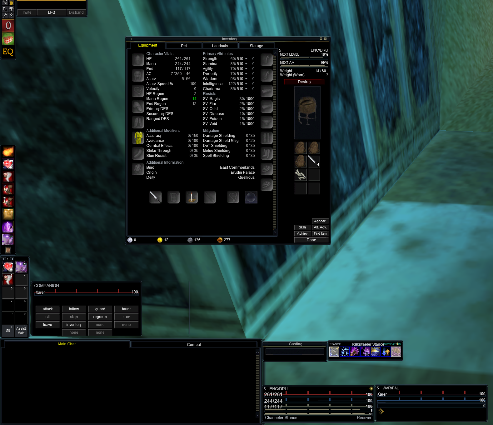
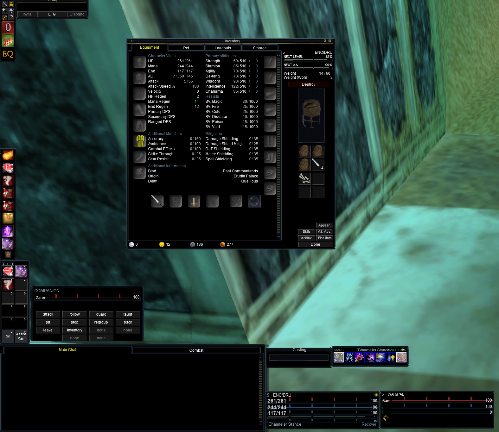
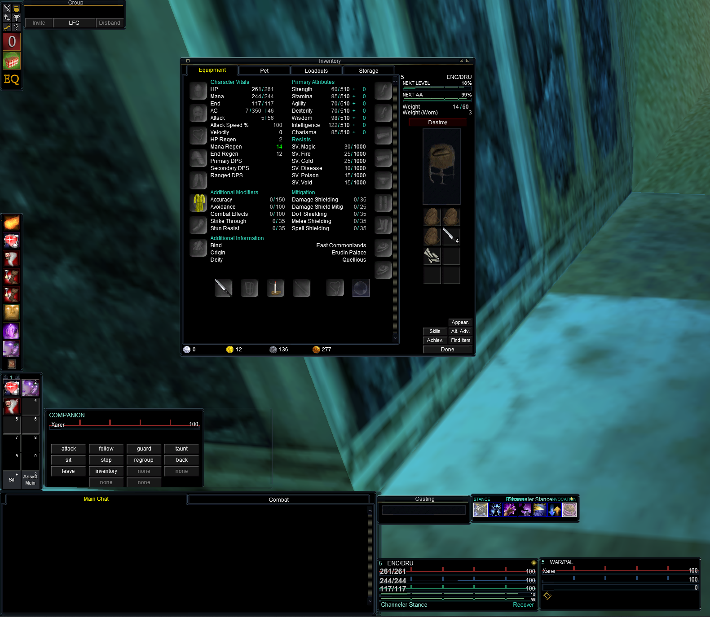
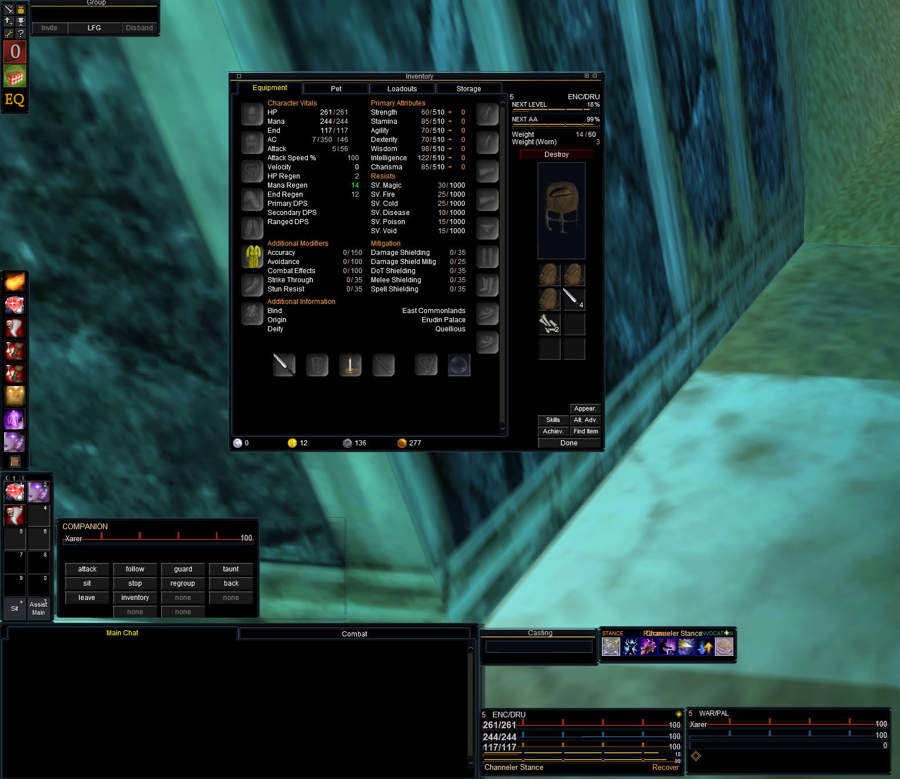
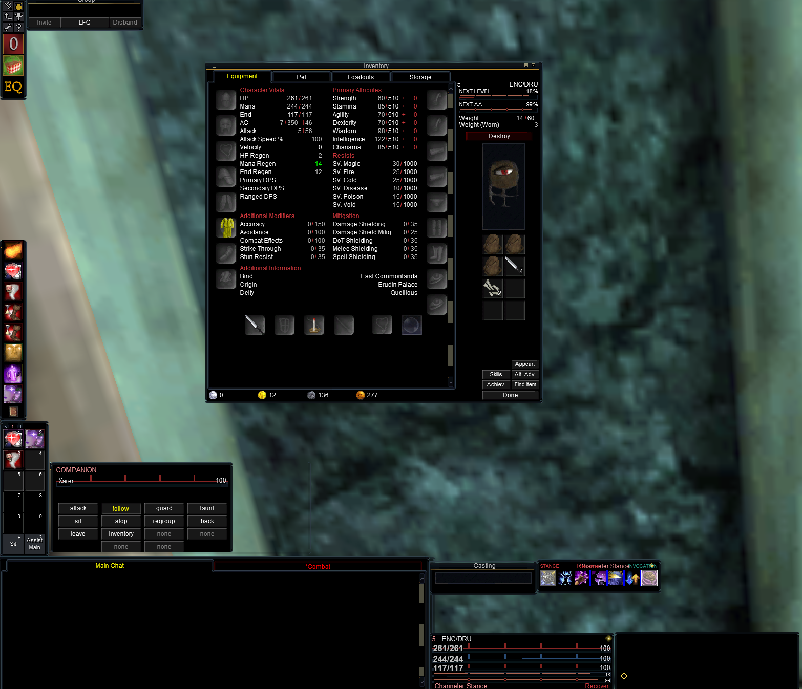
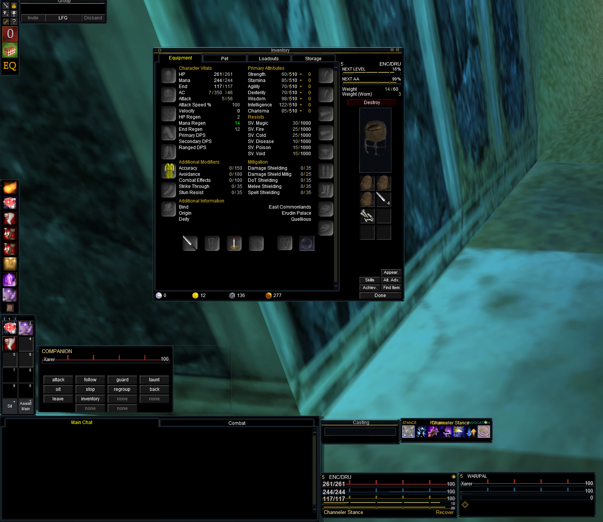
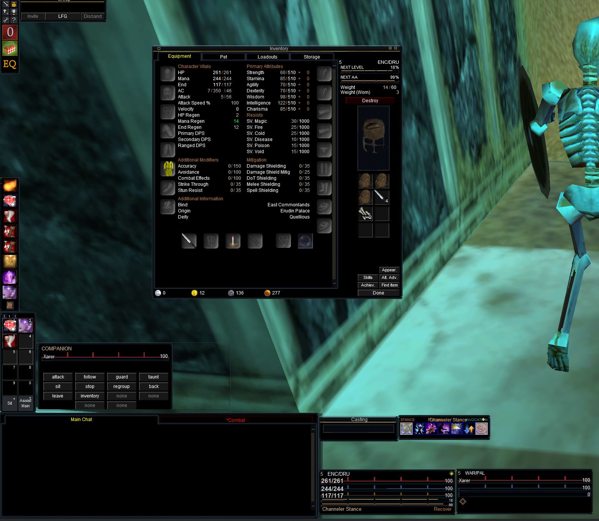
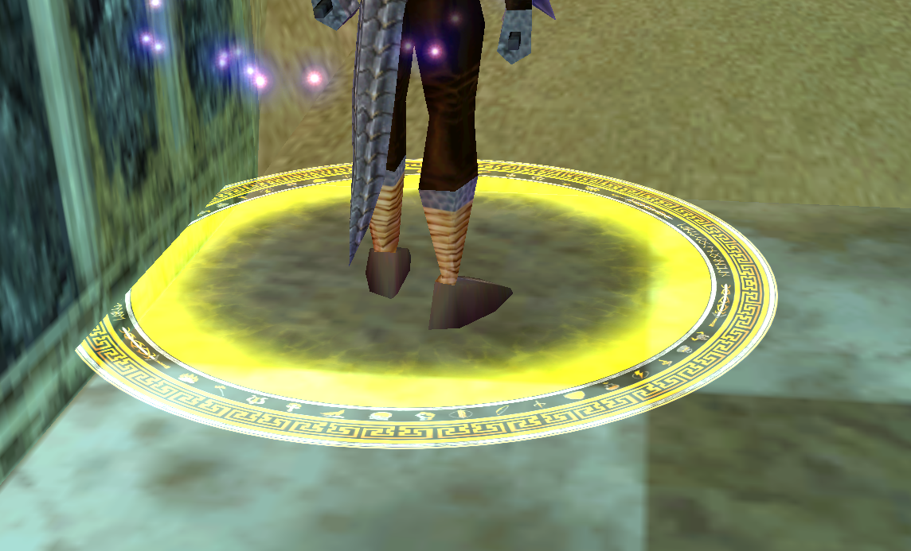
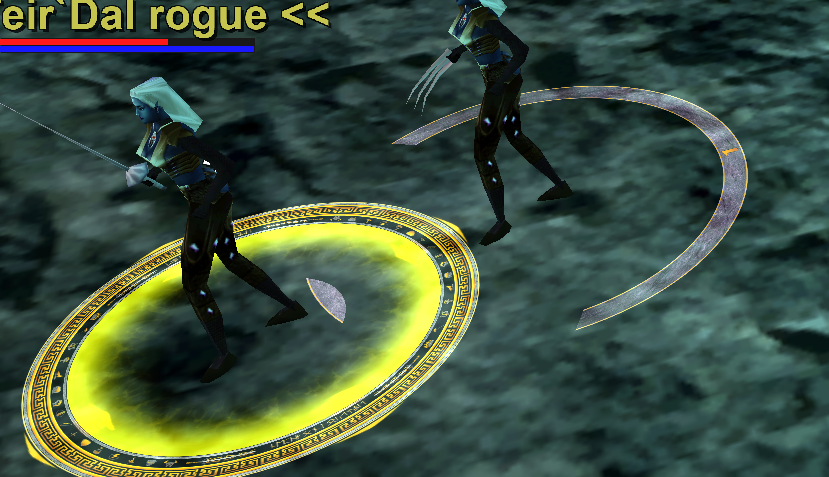
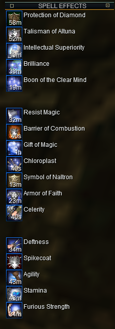

# SparxxUI for EverQuest Legends

The classic **Sparxx** look, rebuilt for **EverQuest Legends**, in seven accent
colors — plus a con-colored 3D target ring.

EverQuest Legends uses a different UI window set than retail EverQuest (a
classic-era client: `EQUI_CharacterSelect`, `EQUI_BuffWindow1`–`17`,
`EQUI_AbilityDisplayWindow`, a required `EQUI_Animations.xml`, and so on). A
retail-era Sparxx skin cannot load on it. These themes use the Legends window
set and wear the Sparxx frames, backgrounds and coloring, so they load cleanly
on Legends.

## Themes

Each theme is a complete skin. They share identical windows and Sparxx chrome
and differ only in accent color:

| Theme | Accent |
|---|---|
| `SparxxDark`     | Steel / silver — classic all-dark |
| `SparxxObsidian` | Deep blue-gray, the moodiest tint |
| `SparxxVenom`    | Teal / cyan |
| `SparxxEmber`    | Warm amber / orange |
| `SparxxRed`      | Crimson |
| `SparxxGold`     | Yellow-gold |
| `SparxxBronze`   | Antique bronze |

HP-red, mana-blue, casting and item-link colors are kept in every theme so
gauges and links stay readable.

## Gallery

| | |
|:---:|:---:|
| **Dark** | **Obsidian** |
|  |  |
| **Venom** | **Ember** |
|  |  |
| **Red** | **Gold** |
|  |  |
| **Bronze** | **3D target ring** |
|  |  |
| **Target ring markers** | **Buff & song timers** |
|  |  |

## The 3D target ring

`TargetRing/` holds the con-colored ring that renders under your target in the
world (grey → green → blue → white → yellow → red by difficulty).

The ring loads from your **active skin's folder** (falling back to `default`). The Sparxx
themes don't carry their own ring, so the installer drops it into `uifiles\default` and it
shows under whichever theme you load. For a **patch-safe** setup, install it into a
**Modified Default / Modified Modern** skin instead (see the installer below): the ring loads
from that custom skin when it's active, and **LaunchPad won't overwrite a custom name** — so
the ring survives patch day.

### Spin options

`TargetRing/options/` has drop-in variants — copy one over
`default\TargetIndicator.ini`, then fully restart EverQuest (the ring is cached
at launch):

| File | Behavior |
|---|---|
| `no-spin.ini`    | Static ring (default). Loads fastest — 9 textures instead of ~574. |
| `spin-slow.ini`  | Slow rotation. |
| `spin.ini`       | Normal rotation. |
| `spin-fast.ini`  | Fast rotation. |

To hand-tune: in a spinning file, `Duration` sets how long the 82-frame cycle
takes — higher = slower. `FrameCount=0` with `Texture=<Color>_0` = no spin.

## Installing — pick one

Two ways to install, and **neither needs any extra software**. The Manual method
is just copying folders. The auto installer automates that copying and now runs on
**Windows PowerShell** — built into Windows, so there's **no Python (or anything
else) to install**. Use whichever you prefer.

## Install — Manual (easiest, just copy folders)

Same drag‑and‑drop copy EverQuest UIs have always used:

1. **Get the files.** On this project's GitHub page, click the green **`< > Code`**
   button → **Download ZIP** (or grab a package from **Releases**). Unzip it.
2. **Find your game folder** — the EverQuest Legends folder that has `eqgame.exe`
   in it. Open the **`uifiles`** folder inside it.
3. **Copy in a theme.** Drag one theme folder (for example `SparxxVenom`) into
   `uifiles`, so you end up with `...\uifiles\SparxxVenom\`.
4. **(Optional) 3D target ring.** Open the `TargetRing` folder, select everything
   **except** the `options` folder, and copy those files into `...\uifiles\default\`.
   Skip this if you don't want the ring.
5. **Load it in game.** Start EverQuest and type:
   ```
   /loadskin SparxxVenom 1
   ```
   Use whichever theme folder you copied. The `1` keeps your window positions.

Close EverQuest before copying files — it rewrites UI files when it exits. The
ring only updates on a **full game restart**, not `/loadskin`.

## Install — Auto installer (optional)

Prefer to have it done for you? The installer is a small menu that copies
everything automatically. It runs on **Windows PowerShell**, which is already part
of Windows — **nothing to download or install**.

1. Unzip the download and open the `SparxxUI_Legends` folder.
2. Double‑click **`Install.bat`**. A small text window opens.
   - If Windows shows a blue **“Windows protected your PC”** box, click
     **More info → Run anyway** (it's just a `.bat` that starts the PowerShell
     installer).
3. It lists the themes — type the **number** of the one you want. Besides the Sparxx themes
   you can pick **Modified Default** / **Modified Modern** (patch-safe, classic-style copies of
   your own `default` / `default_modern` skin — Gameface stripped so they render like the
   Sparxx themes — with the ring installed into them so it survives patches), **Install ALL
   themes**, or **Target ring only**. Press **Enter**.
4. It asks about the **target ring** — type the number for your choice (no spin /
   slow / normal / fast, or keep the game's default) and press **Enter**.
5. A **folder‑picker window** opens — browse to your **EverQuest Legends** folder
   (the one with `eqgame.exe`) and click **Select Folder**.
6. It copies everything and prints **Done**. Close the window.

Then load it in game — start EverQuest and type:
```
/loadskin SparxxVenom 1
```
Use whichever theme you installed (the installer prints the exact command). The
`1` keeps your window positions.

The installer copies the theme into `uifiles\<ThemeName>\` and the ring into
`uifiles\default\`. If any of this feels like too much, the **Manual** method
above does the same thing.

## Notes

- If windows look misplaced the first time, that's saved positions, not the
  skin — drag them, or remove your `UI_<character>_<server>.ini` to start fresh.
- To remove the ring later, delete the ring files and `TargetIndicator.ini` from the skin
  you installed it into (`uifiles\default`, or your `Modified Default` / `Modified Modern`
  folder); the client falls back to its built-in ring.
- The installer uses Windows' built‑in folder browser to pick your game folder.
  If it can't open for any reason, it just asks you to paste the path instead.

## Troubleshooting

**The installer flashes and closes, or says script execution is disabled**
Always start it with **`Install.bat`** (double‑click it) — the `.bat` launches
PowerShell with the right settings. Don't run `install.ps1` on its own. If Windows
SmartScreen shows **“Windows protected your PC”**, click **More info → Run anyway**.
Either way, the **Manual** install above needs no installer at all.

**“Python was not found” / a Microsoft Store window opens**
That's from an older version that used Python. Re‑download the latest release —
the installer now uses PowerShell and never touches Python.

**The UI didn't change after `/loadskin`**
- Make sure the theme folder is directly inside `uifiles` — i.e.
  `...\uifiles\SparxxVenom\EQUI.xml`, not `...\uifiles\SparxxVenom\SparxxVenom\`.
- The name in `/loadskin` must match the folder exactly, e.g.
  `/loadskin SparxxVenom 1` for the `SparxxVenom` folder.
- Copy files while EverQuest is **closed** — it rewrites UI files when it exits.

**The target ring didn't appear**
- The ring loads from your **active skin's folder** (falling back to `uifiles\default`). The
  installer puts it in `default` for the Sparxx themes, or in your **Modified Default /
  Modified Modern** skin — make sure it's in the skin you actually loaded.
- The ring loads at startup, so you need a **full game restart** (quit to desktop and
  relaunch), not `/loadskin`.
- On patch days LaunchPad can restore `uifiles\default`, removing a ring installed there — a
  **Modified Default / Modified Modern** skin avoids this (LaunchPad leaves custom names
  alone). Otherwise just re‑install.

**Windows are off‑screen, overlapping, or in weird spots**
That's your **saved window positions**, not the skin. Drag them where you want,
or to start fresh close the game and delete your `UI_<character>_<server>.ini`
(in the main EverQuest folder) — the game rebuilds it at default positions.

**Buff/song timers aren't showing**
The timer text is drawn on the buff icon, and the client only draws it when
"Show Buff Timer" is on: **Options → Display → Show Buff Timer**.

**It looks broken / I want to undo everything**
Delete the theme folder from `uifiles`, load the stock UI with
`/loadskin default 1` (or `/loadskin default_modern 1`), and remove the ring
files from `uifiles\default` if you added them.

## Credits

- **SparxxUI** — the original EverQuest interface this look is based on.
- Rebuilt and themed for **EverQuest Legends**; target ring and installer added
  for this release.
